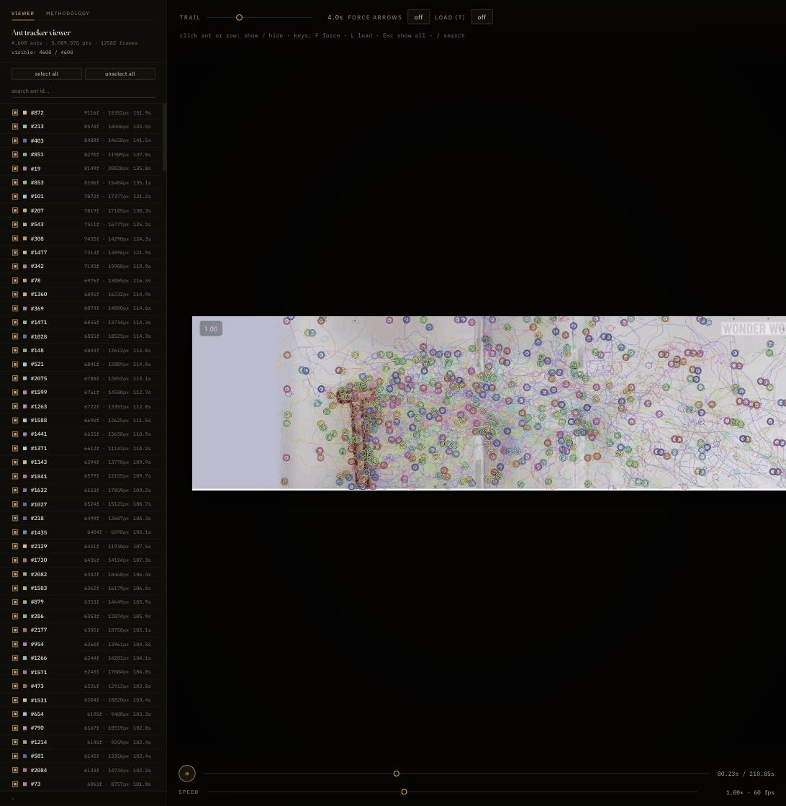

# ants-philip

Multi-ant tracking and identity recovery from top-down cooperative-behavior footage.

[**▶ Open the viewer (live)**](https://theosech.github.io/ants-philip/) · [demo GIF below]



The pipeline takes a top-down video of many ants (here: ~400 ants pushing a T-shaped load through barriers, from a [Wonder World clip](https://www.youtube.com/watch?v=j9xnhmFA7Ao)) and produces per-ant trajectories with global identities preserved through cluster events. A browser viewer renders the resolved tracks frame-by-frame for analysis. See [`pipeline/IDENTITY_SOLVER.md`](pipeline/IDENTITY_SOLVER.md) for the methodology behind the cluster-event solver.

## Status & context

This was built during a CIMC hackathon as a tangible example of **collective intelligence arising bottom-up**: ~400 ants pushing a T-shape through barriers with no central coordinator — colony-level behavior emerges from individual ants following simple local rules. The point of building it is to have a concrete system to study, model, and hopefully generalize collective-intelligence insights from.

The current tracks are **useful but far from perfect**. Identity switching still happens substantially more than it should, especially inside dense cluster events on the load. The identity solver helps but it isn't the end state. The natural next steps for improving track quality are hyperparameter tuning (`MAX_LOST`, cluster-event detection thresholds, continuation-edge generosity, count-conservation tolerances) and better collision handling — re-matching ants at cluster exits using appearance features, motion priors, or longer-window re-id rather than the current count-conserved 1:1 / 2:2 bridges.

Even with imperfect tracks the viewer dramatically lowers the cost of investigating individual ant behavior: scrub to a moment, focus on one ant, ask what local rule its motion is consistent with. The tracks — current or improved — also support the harder direction: **empirically validating a hypothesized policy** for individual ant behavior. Given a proposed local rule, simulate it on the same arena and compare against the observed trajectories. That's the lever for separating colony-level outcomes from individual-level representations and intelligence, and what makes this a candidate model system for studying emergent collective behavior more broadly.

## Viewer

The hosted viewer streams pre-computed resolved tracks from the [`v0.1.0`](https://github.com/theosech/ants-philip/releases/tag/v0.1.0) release. Open https://theosech.github.io/ants-philip/ — no install required.

What you can do in the viewer:

- **Per-ant visibility**: each ant has a checkbox; click any row (or the ant on the canvas) to toggle. `select all` / `unselect all` operate on the search-filtered list.
- **Search**: filter the sidebar by ID prefix (press `/` to focus).
- **Trail length**: log-scale slider from 0 s (hide) to the full video duration. Hard time-window cutoff — colors stay constant intensity over the whole window.
- **Speed**: log-scale slider from 1/16× (slow-motion frame stepping) to 64× (drives `currentTime` directly past the browser's native ~16× cap).
- **Methodology tab**: switches the stage area to a typeset description of how the identity solver works.
- **Force-arrow & load overlays** (off by default): toggle short force arrows when an ant contacts the load, or the load's bounding box, via `F` / `L`.
- **Live + interpolated states**: bold colored ring on a dark halo when the ant has a real detection at that frame; dashed ring at a linearly-interpolated position when the ant is in a detection gap.
- **Keyboard**: `Space` play/pause, `←` / `→` step frame (`Shift+→` jumps 10), `F` force, `L` load, `Esc` unhide all, `/` focus search.

## Pipeline

| Stage | Script | What it does |
|-------|--------|--------------|
| 1     | [`pipeline/run.py`](pipeline/run.py) | Background-subtraction detector + Hungarian linker with constant-velocity prior. Emits per-frame `(x, y, θ, area, ant_id)`. |
| 2     | [`pipeline/stitch_tracks.py`](pipeline/stitch_tracks.py) | Velocity-extrapolation pass that merges fragmented tracks across short occlusions. |
| 3a    | [`pipeline/cluster_events.py`](pipeline/cluster_events.py) | Detects cluster events (multiple ants disappearing/appearing together). |
| 3b    | [`pipeline/tracklet_graph.py`](pipeline/tracklet_graph.py) | Builds a graph: nodes = tracklets + events; edges = continuation, merge-in, split-out. |
| 3c    | [`pipeline/identity_solver.py`](pipeline/identity_solver.py) | Greedy union-find solver with count-conserved 1:1 / 2:2 cluster passthrough bridges. |
| 4     | [`pipeline/export_viewer.py`](pipeline/export_viewer.py) → [`pipeline/viewer/`](pipeline/viewer/) | Packs resolved tracks into a compact binary blob; static-served HTML viewer reads it. |

[`pipeline/load_track.py`](pipeline/load_track.py) tracks the red T-shape (the "load") separately. [`pipeline/run_step1_max60.py`](pipeline/run_step1_max60.py) is a thin wrapper that runs stage 1 at 60 fps with a longer grace window — the configuration that fed the identity solver above.

## Setup

Requires Python ≥ 3.12 and [uv](https://docs.astral.sh/uv/).

```bash
git clone https://github.com/cimcai/ants-philip.git
cd ants-philip
uv sync
```

The lockfile pins all dependencies. `imageio-ffmpeg` provides a bundled ffmpeg binary, so no system-level ffmpeg install is needed.

## Get the data

The 65 MB source video and a pre-computed resolved-tracks parquet are hosted as release assets on the [`theosech/ants-philip`](https://github.com/theosech/ants-philip/releases/tag/v0.1.0) fork:

```bash
./scripts/fetch_data.sh
```

This downloads:
- `ants_full.mp4` (65 MB) → repo root
- `pipeline/tracks_clean.parquet` (80 MB) — pre-computed resolved tracks (4,635 gids), so you can skip the slow CV stages and view results immediately.

## Run

**Fast path — viewer only** (uses the fetched pre-computed tracks):

```bash
uv run python pipeline/export_viewer.py
python3 pipeline/viewer/serve.py
# open http://localhost:8765
```

**Full pipeline** (re-derives `tracks_clean.parquet` from the source video; ~10–30 min for stages 1–2):

```bash
# Stage 1: detect + track (default --step 2 → 30 fps effective)
uv run python -m pipeline.run

# Stage 1 alt: --step 1 + MAX_LOST=60 (the configuration tuned for the identity solver)
uv run python -m pipeline.run_step1_max60

# Stage 2: stitch tracks across short gaps
uv run python -m pipeline.stitch_tracks --in pipeline/tracks_step1_maxlost60.parquet --out pipeline/tracks_step1_maxlost60_clean.parquet

# Stage 3: identity solver (a-c chained)
uv run python pipeline/cluster_events.py
uv run python pipeline/tracklet_graph.py
uv run python pipeline/identity_solver.py

# Wire the resolved tracks into the viewer and serve
uv run python -c "import pandas as pd; \
  df = pd.read_parquet('pipeline/tracks_resolved.parquet'); \
  df[['frame','t_ms','gid','x','y','theta','area']].rename(columns={'gid':'ant_id'}).to_parquet('pipeline/tracks_clean.parquet', index=False)"
uv run python pipeline/export_viewer.py
python3 pipeline/viewer/serve.py
```

The audit script reproduces the result-table metrics on any tracks parquet:

```bash
uv run python pipeline/aphilip_failure_audit.py pipeline/tracks_clean.parquet
```

## Repository layout

```
ants-philip/
├── ants_full.mp4              # source video (release asset, gitignored)
├── pipeline/
│   ├── run.py                 # detect + track
│   ├── run_step1_max60.py     # step=1 / MAX_LOST=60 wrapper
│   ├── load_track.py          # red-T (load) tracker
│   ├── stitch_tracks.py       # post-process stitcher
│   ├── cluster_events.py      # identity-solver step 1
│   ├── tracklet_graph.py      # identity-solver step 2
│   ├── identity_solver.py     # identity-solver step 3
│   ├── IDENTITY_SOLVER.md     # methodology doc
│   ├── aphilip_failure_audit.py
│   ├── *_overlay.py           # diagnostic visualizations
│   ├── export_viewer.py       # pack tracks for viewer
│   ├── seed_detect.py         # classical seed boxes (used by sam2_modal)
│   ├── sam2_modal.py          # SAM 2.1 video segmenter on Modal (reference; not used in pipeline)
│   ├── filter_grid_artifacts.py  # remove static-grid false positives
│   └── viewer/
│       ├── index.html         # browser viewer
│       └── serve.py           # range-request HTTP server
├── scripts/
│   └── fetch_data.sh          # download release assets
├── docs/
│   └── viewer-demo.gif        # this README's demo
├── pyproject.toml
├── uv.lock
└── LICENSE                    # MIT
```

## License

[MIT](LICENSE).
